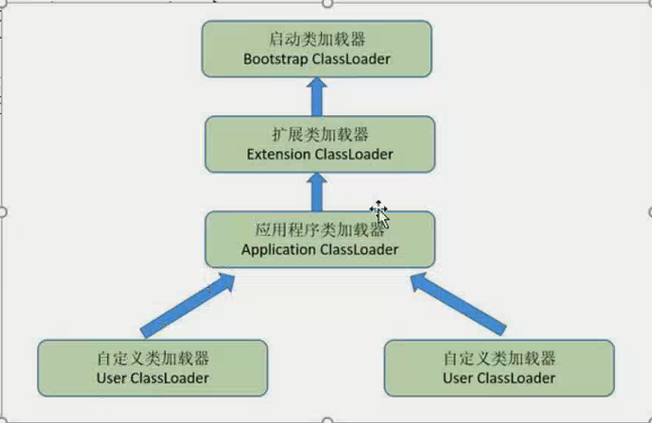

# 类加载器

## 类与类加载器

### 判断类是否“相等”

任意一个类，都由**加载它的类加载器**和这个**类本身**一同确立其在 Java 虚拟机中的唯一性，每一个类加载器，都有一个独立的类名称空间。

因此，比较两个类是否“相等”，只有在这两个类是由同一个类加载器加载的前提下才有意义，否则，即使这两个类来源于同一个 Class 文件，被同一个虚拟机加载，只要加载它们的类加载器不同，那么这两个类就必定不相等。

这里的“相等”，包括代表类的 Class 对象的 equals\(\) 方法、isInstance\(\) 方法的返回结果，也包括使用 instanceof 关键字做对象所属关系判定等情况。

### 加载器种类

系统提供了 3 种类加载器：

* 启动类加载器（Bootstrap ClassLoader）：  负责将存放在 `<JAVA_HOME>\lib` 目录中的，并且能被虚拟机识别的（仅按照文件名识别，如 rt.jar，名字不符合的类库即使放在 lib 目录中也不会被加载）类库加载到虚拟机内存中。
* 扩展类加载器（Extension ClassLoader）：  负责加载 `<JAVA_HOME>\lib\ext` 目录中的所有类库，开发者可以直接使用扩展类加载器。
* 应用程序类加载器（Application ClassLoader）：  由于这个类加载器是 ClassLoader 中的 getSystemClassLoader\(\) 方法的返回值，所以一般也称它为“系统类加载器”。它负责加载用户类路径（classpath）上所指定的类库，开发者可以直接使用这个类加载器，如果应用程序中没有自定义过自己的类加载器，一般情况下这个就是程序中默认的类加载器。


- 当然，如果有必要，还可以加入自己定义的类加载器。
  - 定义一个类，继承ClassLoader
  - 重写loadClass方法
  - 实例化Class对象

```java
public class ClassLoaderDemo {
	public static void main(String[] args) throws Exception {
        ClassLoader myClassLoader = new ClassLoader() {
            /**
             * @param name 全类名
             */
            @Override
            public Class<?> loadClass(String name) throws ClassNotFoundException {
                String fileName = name.substring(name.lastIndexOf(".") + 1) + ".class";
                InputStream ins = getClass().getResourceAsStream(fileName);
                if (ins == null) {
                    // 如果为null,则使用父类的类加载器去加载
                    return super.loadClass(name);
                }
                try {
                    byte[] buff = new byte[ins.available()];
                    ins.read(buff);
                    return defineClass(name, buff, 0, buff.length);
                } catch (Exception e) {
                    throw new ClassNotFoundException();
                }
            }
        };
        
        Object c = myClassLoader.loadClass("com.xwl.prison.break.ClassLoaderDemo").newInstance();
        
        System.out.println(c.getClass()); // class com.xwl.prison.break.ClassLoaderDemo
        
        System.out.println(c instanceof ClassLoaderDemo); // false 不是同一个加载器加载
    }
}
```


**自定义类加载器的优势：**

- 类加载器是Java语言的一项创新，也是Java语言流行的重要原因之一，它最初的设计是为了满足Java Applet的需求而开发出来的
- 高度的灵活性
- 通过自定义类加载器可以实现热部署
- 代码加密

## 双亲委派模型

### 什么是双亲委派模型

双亲委派模型是描述类加载器之间的层次关系。它要求除了顶层的启动类加载器外，其余的类加载器都应当有自己的父类加载器。（父子关系一般不会以继承的关系实现，而是以组合关系来复用父加载器的代码）

从jdk1.2开始，Java虚拟机规范推荐开发者使用双亲委派模式（ParentsDelegation Model）进行类加载，其加载过程如下：

1. 如果一个类加载器收集到了类加载请求，它首先不会自己去尝试加载这个类，而是把类加载请求委派给父类加载器去完成。
2. 每一层的类加载器都把类加载请求委派给父类加载器，直到所有的类加载请求都应该传递给顶层的启动类加载器
3. 如果顶层的启动类加载器无法完成加载请求，子类加载器尝试去加载，如果连最初发起类加载请求的类加载器也无法完成加载请求时，将会抛出ClassNotFoundException，而不再调用其子类加载器去进行类加载。

### 工作过程



如果一个类加载器收到了类加载的请求，它首先不会自己去尝试加载这个类，而是把这个请求委派给父类加载器去完成，每一个层次的类加载器都是如此，因此所有的加载请求最终都应该传送到顶层的启动类加载器中，只有当父加载器反馈自己无法完成这个加载请求（找不到所需的类）时，子加载器才会尝试自己去加载。

在 java.lang.ClassLoader 中的 loadClass\(\) 方法中实现该过程。

### 为什么使用双亲委派模型

像 java.lang.Object 这些存放在 rt.jar 中的类，无论使用哪个类加载器加载，最终都会委派给最顶端的启动类加载器加载，从而使得不同加载器加载的 Object 类都是同一个。

相反，如果没有使用双亲委派模型，由各个类加载器自行去加载的话，如果用户自己编写了一个称为 java.lang.Object 的类，并放在 classpath 下，那么系统将会出现多个不同的 Object 类，Java 类型体系中最基础的行为也就无法保证。

### 双亲委派模式的类加载器的优点

Java类它的类加载器一起具备了一种带优先级的层次关系，越是基础的类，越是被上层的类加载器进行加载，保证了Java程序的稳定运行。

（完）

---
👉 [Previous](/docs/09-load-class-process)<br>
👉 [Next](../README.md)<br>
👉 [Back to README](../README.md)