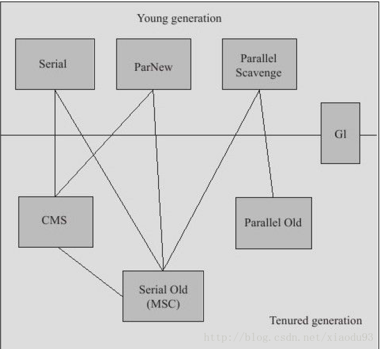
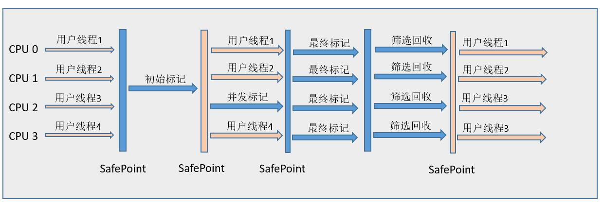

# HotSpot 垃圾收集器

HotSpot 虚拟机提供了多种垃圾收集器，每种收集器都有各自的特点，虽然我们要对各个收集器进行比较，但并非为了挑选出一个最好的收集器。我们选择的只是对具体应用最合适的收集器。



图示展示了7中作用于不同分代的收集器，如果两个收集器之间存在连线，就说明它们可以搭配使用。虚拟机所处的区域，则表示他是属于新生代收集器还是老年代收集器。

## 新生代垃圾收集器

### Serial 垃圾收集器（单线程、新生代、复制算法）

只开启**一条** GC 线程进行垃圾回收，并且在垃圾收集过程中停止一切用户线程\(Stop The World\)。

一般客户端应用所需内存较小，不会创建太多对象，而且堆内存不大，因此垃圾收集器回收时间短，即使在这段时间停止一切用户线程，也不会感觉明显卡顿。因此 Serial 垃圾收集器**适合客户端**使用。

由于 Serial 收集器只使用一条 GC 线程，避免了线程切换的开销，从而简单高效。

是虚拟机运行在client模式下的默认**新生代**收集器。采用**复制算法**。 


### ParNew 垃圾收集器（多线程、新生代、复制算法）

ParNew 是 Serial 的多线程版本。由多条 GC 线程并行地进行垃圾清理。但清理过程依然需要 Stop The World。

ParNew 追求“**低停顿时间**”,与 Serial 唯一区别就是使用了多线程进行垃圾收集，在多 CPU 环境下性能比 Serial 会有一定程度的提升；但**线程切换需要额外的开销**，因此在单 CPU 环境中表现不如 Serial。

默认开启的收集线程数与CPU的数量相同


### Parallel Scavenge 垃圾收集器（并行多线程、新生代，复制算法）

特点：

- 复制算法（新生代收集器）
- 多线程收集器
- 达到可控制的吞吐量

Parallel Scavenge 和 ParNew 一样，都是多线程、新生代垃圾收集器。但是两者有巨大的不同点：

* Parallel Scavenge：追求 CPU 吞吐量，能够在较短时间内完成指定任务，因此适合没有交互的后台计算。
* ParNew：追求降低用户停顿时间，适合交互式应用。

吞吐量 = 运行用户代码时间 / \(运行用户代码时间 + 垃圾收集时间\)

追求高吞吐量，可以通过减少 GC 执行实际工作的时间，然而，仅仅偶尔运行 GC 意味着每当 GC 运行时将有许多工作要做，因为在此期间积累在堆中的对象数量很高。单个 GC 需要花更多的时间来完成，从而导致更高的暂停时间。而考虑到低暂停时间，最好频繁运行 GC 以便更快速完成，反过来又导致吞吐量下降。

* 通过参数 -XX:GCTimeRadio 设置垃圾回收时间占总 CPU 时间的百分比（吞吐量大小）。                    范围：（0， 100），默认值99。
* 通过参数 -XX:MaxGCPauseMillis 设置垃圾处理过程最久停顿时间。
* 通过命令 -XX:+UseAdaptiveSizePolicy 开启自适应策略。我们只要设置好堆的大小和 MaxGCPauseMillis 或 GCTimeRadio，收集器会自动调整新生代的大小、Eden 和 Survivor 的比例、对象进入老年代的年龄，以最大程度上接近我们设置的 MaxGCPauseMillis 或 GCTimeRadio。


### 并行与并发

- 并行(Parallel)：指比如多条垃圾收集线程同时工作，但此时用户线程仍然处于等待状态。
- 并发(Concurrent)：指用户线程与垃圾收集线程同时执行（但不一定是并行的，可能会交替执行），用户线程在继续运行，而垃圾收集程序运行于另一个CPU上。


## 老年代垃圾收集器

### Serial Old 垃圾收集器（单线程、老年代、标记-整理算法）

Serial Old 收集器是 Serial 的老年代版本，都是单线程收集器，只启用一条 GC 线程，都适合client客户端应用。它们唯一的区别就是：Serial Old 工作在老年代，使用“标记-整理”算法；Serial 工作在新生代，使用“复制”算法。

### Parallel Old 垃圾收集器（多线程、老年代、标记-整理算法）

Parallel Old 收集器是 Parallel Scavenge 的老年代版本，追求 CPU 吞吐量。

### CMS 垃圾收集器（老年代、标记-清除算法）

CMS\(Concurrent Mark Sweep，并发标记清除\)收集器是==以获取最短回收停顿时间为目标的收集器==（追求低停顿），目前很大一部分的java应用集中在互联网站或者B/S系统的服务端上，它在垃圾收集时使得用户线程和 GC 线程并发执行，因此在垃圾收集过程中用户也不会感到明显的卡顿。CMS并不是一个完全并发的垃圾收集器

工作过程：

1. 初始标记(CMS initial mark)：Stop The World，仅使用一条初始标记线程对所有与 GC Roots 直接关联的对象进行标记，速度很快。
2. **并发**标记(CMS concurrent mark)：使用**多条**标记线程，与用户线程并发执行，进行GC Roots Tracing的过程。此过程进行可达性分析，标记出所有废弃对象。速度很慢。
3. 重新标记(CMS remark)：Stop The World，使用多条标记线程并发执行，将刚才并发标记过程中新出现的废弃对象标记出来，这个过程时间比初始标记稍长，但远比并发标记时间短。
4. **并发**清除(CMS concurrent sweep)：只使用一条 GC 线程，与用户线程并发执行，清除刚才标记的对象。这个过程非常耗时。

并发标记与并发清除过程耗时最长，且可以与用户线程一起工作，因此，**总体上说**，CMS 收集器的内存回收过程是与用户线程**一起并发执行**的。


CMS优点：

- 并发收集
- 低停顿

CMS 的缺点：

* 吞吐量低，占用大量的cpu资源
* 无法处理浮动垃圾，导致频繁 Full GC
* 出现Concurrent Mode Failure
* 使用“标记-清除”算法产生碎片空间

对于产生碎片空间的问题，可以通过开启 -XX:+UseCMSCompactAtFullCollection，在每次 Full GC 完成后都会进行一次内存压缩整理，将零散在各处的对象整理到一块。设置参数 -XX:CMSFullGCsBeforeCompaction告诉 CMS，经过了 N 次 Full GC 之后再进行一次内存整理。

### G1 通用垃圾收集器



G1 是一款面向服务端应用的垃圾收集器，<u>==它没有新生代和老年代的概念，而是将堆划分为一块块独立的 Region==</u>。当要进行垃圾收集时，首先估计每个 Region 中垃圾的数量，每次都从垃圾回收价值最大的 Region 开始回收，因此可以获得最大的回收效率。

**从整体上看**， G1 是基于“**标记-整理**”算法实现的收集器，**从局部**（两个 Region 之间）上看是基于“**复制**”算法实现的，这意味着运行期间不会产生内存空间碎片。

这里抛个问题👇<br>
一个对象和它内部所引用的对象可能不在同一个 Region 中，那么当垃圾回收时，是否需要扫描整个堆内存才能完整地进行一次可达性分析？

并不！每个 Region 都有一个 Remembered Set，用于记录本区域中所有对象引用的对象所在的区域，进行可达性分析时，只要在 GC Roots 中再加上 Remembered Set 即可防止对整个堆内存进行遍历。

优势：

1. 并行与并发：G1能充分利用多CPU，多核环境的硬件优势，使用多个CPU来缩短stop the world停顿的时间
2. 分代收集：与其他收集器一样，分代概念在G1中依然得以保留。虽然G1可以不需要其他收集器配合就能独立管理整个GC堆。但他能够采用不同的方式去处理创建的对象和已经存活了一段时间、熬过多次GC的旧对象以获取更好的收集效果。
3. 空间整合：与CMS的”标记-清除“算法不同，**从整体上看**， G1 是基于“**标记-整理**”算法实现的收集器，**从局部**（两个 Region 之间）上看是基于“**复制**”算法实现的，这意味着运行期间不会产生内存空间碎片。
4. 可预测的停顿：这是G1相对于CMS的另一大优势，降低停顿时间是G1和CMS关注的点，但G1除了追求低停顿外，还能建立可预测的停顿时间模型，能让使用者明确指定一个长度为M毫秒的时间片段内，消耗在垃圾收集上的时间不得超过N毫秒，这几乎已经是实时java(RTSJ)的垃圾收集器的特征了。

如果不计算维护 Remembered Set 的操作，G1 收集器的工作过程分为以下几个步骤：

* 初始标记(Initial Marking)：Stop The World，仅使用一条初始标记线程对所有与 GC Roots 直接关联的对象进行标记。需要停顿线程，耗时很短
* 并发标记(Concurrent marking)：使用**一条**标记线程与用户线程**并发**执行。**此过程进行可达性分析**，速度很慢，耗时长。
* 最终标记(Final Marking)：Stop The World，使用多条标记线程并发执行。
* 筛选回收(Live Data Counting and Evacuation)：回收废弃对象，此时也要 Stop The World，并使用多条筛选回收线程并发执行。


## GC日志

### 理解GC日志

阅读GC日志是处理Java虚拟机内存问题的基础技能。

```java
33.125：[GC[DefNew：3324K-＞152K（3712K），0.0025925secs]3324K-＞152K（11904K），0.0031680 secs]

100.667：[FullGC[Tenured：0K-＞210K（10240K），0.0149142secs]4603K-＞210K（19456K），[Perm：2999K-＞2999K（21248K）]，0.0150007 secs][Times：user=0.01 sys=0.00，real=0.02 secs]

```

最前面的数字“33.125：”和“100.667：”代表了GC发生的时间，这个数字的含义是从Java虚拟机启动以来经过的秒数。

==GC日志开头的 “[GC” 和 “[Full GC” 说明了这次垃圾收集的停顿类型，而不是用来区分新生代GC还是老年代GC的==。如果有“Full”，说明这次GC是发生了Stop-The-World的，例如下面这段新生代收集器ParNew的日志也会出现“[Full GC”（这一般是因为出现了分配担保失败之类的问题，所以才导致STW）。如果是调用System.gc（）方法所触发的收集，那么在这里将显示“[Full GC（System）”。

[Full GC 283.736：[ParNew：261599K-＞261599K（261952K），0.0000288 secs]

接下来的 “[DefNew”、“[Tenured”、“[Perm” 表示GC发生的区域，这里显示的区域名称与使用的GC收集是密切相关的，例如上面样例所使用的Serial收集器中的新生代名为“Default New Generation”，所以显示的是“[DefNew”。

如果是ParNew收集器，新生代名称就会变为“[ParNew”，意为“Parallel New Generation”。

如果采用Parallel Scavenge收集器，那它配套的新生代称为“PSYoungGen”，老年代和永久代同理，名称也是由收集器决定的。

后面方括号内部的“3324K-＞152K（3712K）”含义是“GC前该内存区域已使用容量-＞GC后该内存区域已使用容量（该内存区域总容量）”。 
而在方括号之外的“3324K-＞152K（11904K）”表示“GC前Java堆已使用容量-＞GC后Java堆已使用容量（Java堆总容量）”。

再往后，“0.0025925 secs”表示该内存区域GC所占用的时间，单位是秒。

有的收集器会给出更具体的时间数据，如“[Times：user=0.01 sys=0.00，real=0.02 secs]”，这里面的user、sys和real与Linux的time命令所输出的时间含义一致，分别代表用户态消耗的CPU时间、内核态消耗的CPU事件和操作从开始到结束所经过的墙钟时间（Wall Clock Time）。

CPU时间与墙钟时间的区别是，墙钟时间包括各种非运算的等待耗时，例如等待磁盘I/O、等待线程阻塞，而CPU时间不包括这些耗时，但当系统有多CPU或者多核的话，多线程操作会叠加这些CPU时间，所以读者看到user或sys时间超过real时间是完全正常的。


## JVM-垃圾收集器常用的GC参数

## 1.与串行回收器相关的参数

- -XX:+UseSerialGC:在新生代和老年代使用串行收集器
- -XX:SurvivorRatio:设置eden区大小和survivor区大小的比例
- -XX:PretenureSizeThreshold:设置大对象直接进入老年代的阈值。当对象的大小超过这个值时，将直接在老年代分配。
- -XX:MaxTenuringThreshold:设置对象进入老年代的年龄的最大值。每一次Minor GC后，对象年龄就加1。任何大于这个年龄的对象，一定会进入老年代。

## 2.与并行GC相关的参数

- -XX:+UseParNewGC:在新生代使用并行收集器
- -XX:+UseParallelOldGC:老年代使用并行回收收集器
- -XX:ParallelGCThreads:设置用于垃圾回收的线程数。通常情况下可以和CPU数量相等，但在CPU数量较多的情况下，设置相对较小的数值也是合理的。
- -XX:MaxGCPauseMillis:设置最大垃圾收集停顿时间。他的值是一个大于0的整数。收集器在工作时，会调整Java堆大小或者其他参数，尽可能把停顿时间控制在MaxGCPauseMillis以内。
- -XX:GCTimeRatio:设置吞吐量大小。它是0-100的整数。假设GCTimeRatio的值为n，那么系统将花费不超过1/(1+n)的时间用于垃圾收集。
- -XX:+UseAdaptiveSizePolicy:打开自适应GC策略。在这种模式下，新生代的大小、eden和survivor的比例、晋升老年代的对象年龄等参数会被自动调整，已达到在堆大小、吞吐量和停顿时间之间的平衡点。

## 3.与CMS回收期相关的参数

- -XX:+UseConcMarkSweepGC:新生代使用并行收集器，老年代使用CMS+串行收集器
- -XX:ParallelCMSThreads:设定CMS的线程数量
- -XX:CMSInitiatingOccupancyFraction:设置CMS收集器在老年代空间被使用多少后触发，默认为68%
- -XX:+UseCMSCompactAtFullCollection:设置CMS收集器完成垃圾收集后是否要进行一次内存碎片的整理
- -XX:CMSFullGCsBeforeCompaction:设定进行多少次CMS垃圾回收后，进行一次内存压缩
- -XX:+CMSClassUnloadingEnabled:允许对类元数据区进行回收
- -XX:CMSInitiatingPermOccupancyFraction:当永久区占用率达到这一百分比时，启动CMS回收(前提是-XX:+CMSClassUnloadingEnabled激活了)
- -XX:UseCMSInitiatingOccupancyOnlyn:表示只在到达阈值的时候才进行CMS回收
- -XX:+CMSIncrementalMode:使用增量模式，比较适合单CPU。增量模式在JDK 8中标记为废弃，并将在JDK 9中彻底移除。

## 4.与G1回收期相关的参数

- -XX:+UseG1GC:使用G1回收器
- -XX:MaxGCPauseMillis:设置最大垃圾收集停顿时间
- -XX:GCPauseIntervalMillis:设置停顿间隔时间

## 5.TLAB相关

- -XX:+UseTLAB:开启TLAB分配
- -XX:+PrintTLAB:打印TLAB相关分配信息
- -XX:TLABSize:设置TLAB大小
- -XX:+ResizeTLAB:自动调整TLAB大小

## 6.其他参数

- -XX:+DisableExplicitGC:禁用显式GC
- -XX:+ExplicitGCInvokesConcurrent:使用并发方式处理显式GC

（完）
---
👉 [Previous](/docs/03-gc-algorithms.md)<br>
👉 [Next](/docs/05-memory-allocation-gc.md)<br>
👉 [Back to README](../README.md)